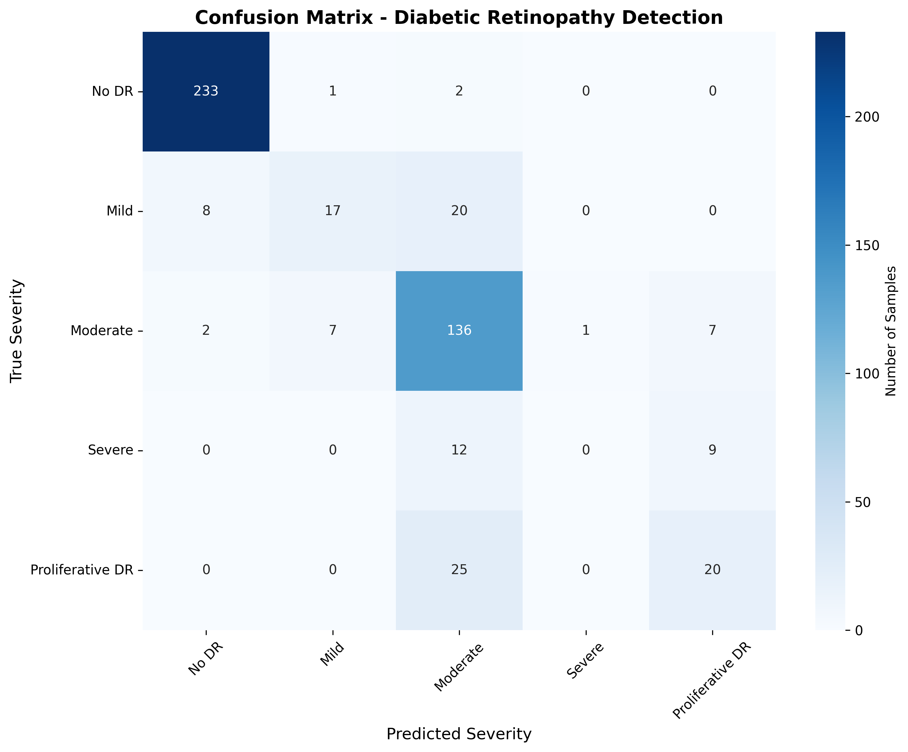

# Retina Disease Detection using Deep Learning

## Overview

This project presents a deep learning–based retinal disease detection system designed for binary classification of retinal fundus images.

The system classifies retinal scans into:

- Diseased Retina
- Healthy Retina

The repository includes:

- Model training pipeline
- Evaluation utilities
- Prediction scripts
- Performance visualization
- Streamlit-based web interface for testing

The objective of this project is to demonstrate the application of computer vision and deep learning techniques in automated medical image analysis.

## Features

- Binary retinal image classification
- Deep learning model training and evaluation
- Streamlit web application for prediction
- Confusion matrix and performance visualization
- CSV-based prediction analysis
- Modular Python implementation

## Project Structure

```
retina-detection/
│
├── binary/web/              # Streamlit web application
├── train.py                 # Model training script
├── evaluate.py              # Evaluation script
├── predict.py               # Prediction script
├── model.py                 # Model architecture
├── utils.py                 # Helper utilities
├── requirements.txt         # Dependencies
│
├── evaluation_results.csv
├── confusion_matrix.png
├── performance_summary.png
└── README.md
```

## Technologies Used

- Python
- TensorFlow / Keras
- OpenCV
- NumPy
- Pandas
- Matplotlib
- Streamlit

## Installation

Clone the repository:

```bash
git clone https://github.com/Suman-SG/retina-detection.git
cd retina-detection
```

Create a virtual environment:

```bash
python -m venv .venv
```

Activate environment (Windows):

```bash
.venv\Scripts\activate
```

Install dependencies:

```bash
pip install -r requirements.txt
```

## Running the Web Application

```bash
cd binary/web
streamlit run smart_app.py
```

## Included model

This repository includes a demo model tracked with Git LFS at:

- `binary/models/quick_test_model.h5`

How to run the demo using the included model (Windows example):

```powershell
cd binary/web
# Set MODEL_PATH to the included model (absolute or workspace-relative)
$env:MODEL_PATH = 'C:\Users\shonu\Desktop\retina_detection\binary\models\quick_test_model.h5'
streamlit run smart_app.py
```

How to run a batch prediction from the command line:

```powershell
# Using explicit --model argument (if supported by your predict.py)
python predict.py --model binary/models/quick_test_model.h5 --input path\to\images --output out.csv

# Or using the environment variable
$env:MODEL_PATH = 'binary/models/quick_test_model.h5'
python predict.py --input path\to\images --output out.csv
```

Notes:

- Git LFS is required to clone the repository with model files: `git lfs install`.
- If you clone this repo and the model is missing, run `git lfs pull` to download LFS-tracked files.
- If your `predict.py` or `smart_app.py` expects a different path, adjust `MODEL_PATH` accordingly.

## Model Evaluation

Example evaluation command:

```bash
python evaluate.py
```

Generated outputs include:

- Accuracy metrics
- Precision / Recall / F1-score
- Confusion matrix
- Performance graphs

## Sample Results

The project includes generated evaluation artifacts:

- `confusion_matrix.png`
- `performance_summary.png`
- `evaluation_results.csv`

These files provide insight into model performance and prediction quality.



## Results

Metrics were computed from `evaluation_results.csv` (500 samples):

- **Accuracy:** 81.20%
- **Weighted precision:** 77.72%
- **Weighted recall:** 81.20%
- **Weighted F1-score:** 78.65%
- **Macro precision:** 57.84%
- **Macro recall:** 53.97%
- **Macro F1-score:** 54.68%

**ROC AUC (from probability outputs):**

- **Per-class AUC:**
	- No DR: 0.9961
	- Mild: 0.9208
	- Moderate: 0.9194
	- Severe: 0.8995
	- Proliferative DR: 0.9091
- **Macro AUC:** 0.9290
- **Micro AUC:** 0.9671

Per-class breakdown (as recorded in `evaluation_results.csv`):

- **No DR** — support: 236 — precision: 95.88% — recall: 98.73% — F1: 97.29%
- **Mild** — support: 45  — precision: 68.00% — recall: 37.78% — F1: 48.57%
- **Moderate** — support: 153 — precision: 69.74% — recall: 88.89% — F1: 78.16%
- **Severe** — support: 21  — precision: 0.00%  — recall: 0.00%  — F1: 0.00%
- **Proliferative DR** — support: 45  — precision: 55.56% — recall: 44.44% — F1: 49.38%

Note: class names correspond to the probability columns in `evaluation_results.csv` (for example: `prob_No DR`, `prob_Mild`, ...). Adjust the names if your dataset uses different labels.

## Future Improvements

- Multi-class retinal disease classification
- Improved dataset balancing
- Real-time deployment support
- Cloud-based inference API
- Explainable AI visualizations (Grad-CAM)

## Disclaimer

This project is intended for educational and research purposes only.
It is not a certified medical diagnostic system.

## Author

**Suman Ghosh**
GitHub: https://github.com/Suman-SG

## License

This project is open-source and available under the MIT License.

---
If you'd like, I can also add a short `CONTRIBUTING.md` and a `LICENSE` file, and push everything to the repo.
